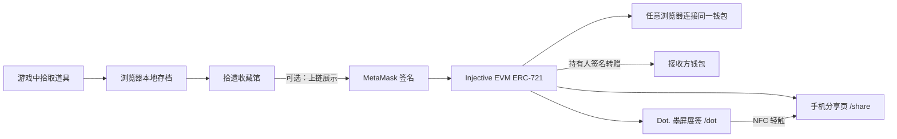

# 《拾遗》Injective 链上收藏系统

> 当前实现版本说明：将《拾遗》游戏内已拾取的文化道具变成玩家可选择上链、可跨浏览器读取、可公开展示并可转赠所有权的 ERC-721 藏品。
>
> 网络：Injective EVM Testnet ｜ Chain ID：`1439` ｜ 货币：`INJ`

---

## 1. 这套区块链功能解决什么问题

游戏道具原本只存在于浏览器本地存档；玩家换浏览器或把游戏分享给朋友时，收藏无法证明和展示。

本项目将“已拾取道具”与“链上 NFT”分成两层：

| 层 | 内容 | 作用 |
|---|---|---|
| 游戏本地层 | 剧情进度、背包、已拾取道具 | 无钱包也能流畅游玩 |
| 链上收藏层 | 玩家主动选择展示的道具 NFT | 可验证所有权、跨浏览器同步、手机分享 |

核心原则是：**游戏不强迫上链；玩家在收藏馆中选择上链后，藏品才会进入其钱包。**



---

## 2. 玩家体验流程

1. 玩家在第一幕调查纸箱，获得“太婆字条”。
2. 道具立刻出现在右上角的**收藏馆**，不需要连接钱包。
3. 玩家点击“查看藏品卡”，翻转卡片查看道具的故事、来源与链上状态。
4. 玩家点击“上链展示”，在 MetaMask 确认交易。
5. 后端等待 Injective EVM 交易确认，收藏馆显示 `已上链` 和 Token ID。
6. 玩家换浏览器后，只要连接同一钱包并点击“读取链上收藏”，已铸造 NFT 会重新出现在收藏馆。
7. 玩家点击“手机分享”，生成公开链接和二维码；手机打开 `/share/?wallet=0x...` 后可只读浏览藏品。
8. 已上链藏品可在游戏闪卡或公开藏品页选择“转赠所有权”，填写接收方 `0x...` 地址并由当前持有人签名；交易确认后 Token 从原钱包转移到接收方钱包。
9. 玩家可选择“投到墨屏”，把藏品生成 `296 × 152` 黑白展签并发送到 Dot. Quote/0；访客轻触设备 NFC 可打开该 Token 的公开页面。

---

## 3. 链上资产模型

### 3.1 当前 NFT 合约

当前接入的是通用 ERC-721 道具合约 `RpgItem`：

- 合约地址：`0xc8167b100bc7Ad611299d634D09b853C6310619e`
- 网络：Injective EVM Testnet（`1439`）
- 每件上链道具对应一个独立 Token ID。
- 私钥始终留在 MetaMask；服务端只创建待签名请求、查询交易和读取资产。

### 3.2 关键 metadata

铸造时，游戏把以下字段写入 ERC-721 的 `tokenURI` data URI：

```json
{
  "name": "太婆字条",
  "item_type": "Gleanings Collectible",
  "collectible_id": "item_taipo_note",
  "category": "道具",
  "rarity": "Story",
  "description": "太婆留在纸箱里的字条，是通往冬酿记忆的第一把钥匙。",
  "source": "《拾遗》· 第一幕 / 纸箱"
}
```

字段用途：

| 字段 | 用途 |
|---|---|
| `collectible_id` | 把链上 Token 与游戏道具 ID 对应起来 |
| `name` / `description` | 收藏馆、闪卡和手机分享页显示 |
| `category` | 区分道具与勋章 |
| `source` | 展示故事来源与章节位置 |
| `image` | 藏品图；新上链藏品写入 Railway 公网 URL，正式发行可迁移为 IPFS URL |

---

## 4. 功能模块与文件路径

### 4.1 游戏前端：收藏馆、上链和闪卡

| 文件 | 功能 |
|---|---|
| `game/src/app/App.tsx` | 钱包状态、链上资产读取、收藏馆、上链与转赠请求、二维码分享、闪卡交互 |
| `game/src/app/app.css` | 收藏馆、链上状态、分享面板和翻转藏品卡样式 |
| `game/src/game/systems/MedalService.ts` | 第一幕完成后保存“冬酿守忆章”本地状态 |
| `game/src/game/systems/SaveService.ts` | 保存第一幕进度和背包内容；收藏馆从这里读取已拾取道具 |
| `game/src/content/act1/*` | 第一幕道具、对白、交互与任务内容 |

收藏馆入口位于游戏顶部：

- `连接钱包`：仅在玩家要上链时需要；按钮只显示钱包末四位。
- 钱包连接层直接显示在游戏内部，不会再打开独立浏览器窗口；浏览器扩展自己的授权提示仍按钱包标准方式出现。
- 钱包地址只保存在当前标签页的 `sessionStorage` 中（键 `gleanings.collection.wallet.session.v1`），关闭标签页即失效；旧版 `localStorage` 钱包缓存会自动清除，不会由同一浏览器的其他标签页或其他访客继承。
- `收藏馆`：无需连接钱包即可打开，显示本地道具和钱包 NFT 的并集。
- `读取链上收藏`：主动刷新当前钱包在合约中的 NFT。
- `上链展示`：对单个道具创建 MetaMask 铸造请求。
- `查看藏品卡`：打开可翻转的故事卡。
- `分享展示链接`：发送只读的单件藏品链接，不改变所有权。
- `转赠链上所有权`：填写接收方 EVM 地址并签名 `safeTransferFrom`；交易确认后接收方成为 Token 新持有人。

### 4.2 链上桥服务

链上桥位于仓库根目录的 `rpg-chain-kit/`：

| 文件 | 功能 |
|---|---|
| `rpg-chain-kit/src/index.js` | Express 服务、CORS、健康检查、Vite 游戏静态资源、手机分享页与分享链接 API |
| `rpg-chain-kit/src/rpg-item-router.js` | 钱包会话、铸造/转让请求、交易确认、NFT 资产与历史读取 |
| `rpg-chain-kit/src/dot-router.js` | Dot. 设备读取、链上持有人校验、296×152 PNG 展签生成与 Image API 推送 |
| `rpg-chain-kit/contracts/RpgItem.sol` | 通用 ERC-721 道具合约源码 |
| `rpg-chain-kit/artifacts/RpgItem.json` | 前端签名页调用合约所需 ABI 与字节码 |
| `rpg-chain-kit/public/connect.html` | 钱包连接页：自动识别 MetaMask、OKX Wallet 等浏览器扩展，也可用 WalletConnect 二维码让手机钱包连接 |
| `rpg-chain-kit/public/wallet.html` | 上链/转让确认页：浏览器扩展和手机扫码钱包均可在此签名 |
| `rpg-chain-kit/public/share/index.html` | 手机优先的公开藏品展示页；支持单件链接分享和链上所有权转赠 |
| `rpg-chain-kit/public/dot/index.html` | 网页与手机通用的墨屏预览、设备选择和推送页面 |
| `rpg-chain-kit/.env.example` | 本地链上网络配置模板 |

### 4.3 Railway 部署文件

| 文件 | 功能 |
|---|---|
| `package.json`（仓库根目录） | Railway 构建入口：安装桥服务依赖、构建 Vite 游戏、启动桥服务 |
| `railway.toml`（仓库根目录） | Railpack、`npm run build`、`npm run start`、`/health` 健康检查 |
| `rpg-chain-kit/railway.env.example` | Railway Variables 配置样例 |
| `rpg-chain-kit/railway.toml` | 仅部署桥服务子目录时可使用的配置 |

---

## 5. API 说明

服务部署后，游戏与手机分享页通过同域 API 调用：

| 方法 | 路径 | 功能 |
|---|---|---|
| `GET` | `/health` | Railway 健康检查 |
| `GET` / `POST` | `/api/rpg/wallet` | 读取/写入当前浏览器的钱包会话 |
| `GET` | `/api/rpg/config` | 返回 Injective 网络与合约配置状态 |
| `POST` | `/api/rpg/requests` | 创建 `mint` 或 `transfer` 待签名请求 |
| `GET` | `/api/rpg/requests/:id` | 查询交易确认状态 |
| `GET` | `/api/rpg/assets/:wallet` | 读取某钱包当前持有的 NFT 和 metadata |
| `GET` | `/api/rpg/history/:tokenId` | 查询某 NFT 的 Transfer 历史 |
| `GET` | `/api/rpg/share-link/:wallet` | 生成手机分享页 URL |
| `GET` | `/api/rpg/dot/devices` | 使用当前会话提交的 Dot API Key 读取个人设备 |
| `GET` | `/api/rpg/dot/card/:wallet/:token.png` | 验证当前链上持有人并生成 296×152 PNG 展签 |
| `POST` | `/api/rpg/dot/push` | 将展签和 NFC 公开链接推送到指定 Dot. 设备 |

静态路由：

| 路径 | 内容 |
|---|---|
| `/` | 《拾遗》游戏主页 |
| `/share/?wallet=0x...` | 公开藏品册；查看无需钱包，转赠需要持有人签名 |
| `/share/?wallet=0x...&token=<id>` | 单件藏品公开链接；网页与手机均可继续发链接或发起所有权转赠 |
| `/dot/?wallet=0x...&token=<id>` | 墨屏展签预览、设备绑定与推送 |
| `/connect.html` | MetaMask 连接窗口 |
| `/wallet.html?request=<id>` | MetaMask 铸造/转让确认窗口 |

---

## 6. Railway 部署与环境变量

仓库：`https://github.com/Zafer-Liu/Gleanings-Injective`

Railway 选择仓库根目录 `/` 部署即可。根目录的构建脚本会：

1. 安装 `rpg-chain-kit` 依赖；
2. 安装并构建 `game` 的 Vite 静态资源；
3. 用 Express 同时托管游戏、API 和分享页。

必须在 Railway → Service → Variables 设置：

```dotenv
EVM_RPC_URL=https://k8s.testnet.json-rpc.injective.network/
RPG_ITEM_CONTRACT_ADDRESS=0xc8167b100bc7Ad611299d634D09b853C6310619e
CHAIN_ID=1439
CHAIN_NAME=Injective EVM Testnet
NATIVE_CURRENCY=INJ
BLOCK_EXPLORER=https://testnet.blockscout.injective.network/
PUBLIC_SHARE_ORIGIN=https://你的服务.up.railway.app
CORS_ORIGINS=https://你的服务.up.railway.app
WALLETCONNECT_PROJECT_ID=你的 WalletConnect Project ID
```

`PORT` 不需要手动填写，Railway 自动注入。保存变量后部署最新 `main` 分支即可。

### 6.1 钱包兼容与手机扫码

收藏馆不会强制连接钱包。需要读取链上藏品、上链展示或转让时，玩家可任选：

1. **浏览器扩展**：连接页通过 EIP-6963 自动发现兼容扩展，已覆盖 MetaMask、OKX Wallet 等 EVM 钱包；用户可以明确选择要连接的扩展。
2. **手机扫码**：连接页和交易确认页均支持 WalletConnect。电脑页面显示二维码后，玩家在手机钱包中使用 WalletConnect 扫码，即可连接或直接确认交易；电脑与手机无需在同一 Wi-Fi。

WalletConnect 的 `Project ID` 是网页项目的公开标识，不是私钥。部署者应在 [WalletConnect Dashboard](https://dashboard.walletconnect.com/) 创建项目，把 Railway 域名加入项目的允许域名列表，再将其填入 Railway Variables 的 `WALLETCONNECT_PROJECT_ID`。未配置该变量时，浏览器扩展方式仍能使用，扫码入口会给出明确的配置提示。

### 6.2 OKX Wallet 接收方说明

NFT 转让只需要对方提供正确的 `0x...` EVM 地址；接收时对方的钱包不必在线，也不必预先连接《拾遗》。但要在 OKX Wallet 中查看或继续转让该 NFT，对方需要添加 Injective EVM Testnet：

```text
网络名称：Injective EVM Testnet
RPC URL：https://k8s.testnet.json-rpc.injective.network/
Chain ID：1439
货币符号：INJ
区块浏览器：https://testnet.blockscout.injective.network/
```

OKX Wallet 可以添加自定义 EVM 网络，操作入口见其[官方说明](https://www.okx.com/en-us/help/how-do-i-add-a-custom-rpc-to-the-okx-web3-wallet)。

---

## 7. 藏品图片与闪卡

收藏馆中的每件道具和勋章都可打开翻转闪卡：正面展示像素藏品图、名称和链上状态，背面展示故事介绍与来源，并可调用系统分享面板。公开手机藏品册也会读取同一图片。

“分享展示链接”和“转赠所有权”是两件不同的事：前者只发送公开页面，Token 仍属于原钱包；后者调用 ERC‑721 `safeTransferFrom` 并产生 Injective EVM 交易，确认后不可由网页撤销。链上桥会在创建请求时验证当前持有人，并在完成时核对实际 `Transfer` 事件中的 Token、发送方和接收方。

### 来访笺：不改变所有权的社交回响

公开收藏馆底部提供“来访笺”。访客无需连接钱包即可选择 `见 / 念 / 暖 / 藏` 印记，并留下 2–60 字的回响；收藏馆会展示最近 12 条内容。来访笺不写入 NFT metadata、不触发链上交易，也不会改变藏品所有权。

接口为 `GET /api/rpg/social/visits/:owner` 与 `POST /api/rpg/social/visits`。生产环境配置 Railway Postgres 的 `DATABASE_URL` 后，服务会自动创建 `gleanings_visits` 表并持久保存内容；未配置时仅启用演示内存模式，服务重启会清空来访笺。每个访客标识对同一收藏馆 30 秒内只能提交一次，用于减轻刷屏。

### 展签轮换投票

公开收藏馆中每件藏品都可“票选下次展签”。同一访客在一个收藏馆中只能保留一票，再次选择别的藏品会改投，因此票数代表不同访客的当前选择，而不是点击次数。投票只影响水墨屏的建议展示排序，不改变 NFT 所有权，也不强制收藏主投放票数最高的藏品。

接口为 `GET /api/rpg/social/votes/:owner` 与 `POST /api/rpg/social/votes`。持久化环境会自动创建 `gleanings_exhibit_votes` 表，并以 `(owner_wallet, visitor_key)` 保证每位访客只能有一个有效投票。

当前可复用素材：

| 藏品 ID | 本地素材 |
|---|---|
| `item_taipo_note` | `assets/rpg_v2/items/it_taipo_note_32x32.png` |
| `act1-winter-brewing` | `assets/rpg_v2/items/it_relic_dongniang_detail_128x128.png` |

当前实现：

1. 图片位于 `assets/rpg_v2/collection/`，Vite 会将其复制到构建产物的 `/collection/`；
2. 本地藏品按 ID 映射图片，旧链上 Token 即使缺少 `image` 也可显示；
3. 新铸造 Token 会把 `https://你的服务.up.railway.app/collection/<id>.png` 写入 metadata；
4. 正式发行时可将图片上传 IPFS，并改写为 `ipfs://<CID>/<filename>`。

---

## 8. Dot. 墨屏展签与现实社交

墨屏功能以手机端为主入口，并使用 MindReset Dot. 的新版 Image API。手机公开藏品页可直接进入 `/dot/`，底部固定“从手机发送到墨屏”按钮，电脑端作为辅助管理入口：

- 输出固定为设备原生 `296 × 152` PNG；服务端使用 Noto Sans SC 将中文转换为 SVG 矢量字形后再栅格化，Railway 与 Dot. 端均不依赖系统中文字体或 SVG WebFont 支持；
- 服务端先将藏品图转为黑白高对比展签，再以 `ditherType: NONE` 推送，保证文字和 Token ID 清晰；
- 展签包含藏品图、Injective EVM Token ID、持有人缩写和公开收藏馆二维码；扫码会打开该持有人的全部公开链上收藏，而不是只打开当前单件藏品；
- Image API 的 `link` 使用短地址 `/api/rpg/dot/nfc/<token>`；轻触后服务端实时查询 `ownerOf` 并跳转至当前持有人的单件藏品页，因此 Token 转赠后 NFC 不会停留在旧钱包；
- Quote/0 的 NFC 会先进入 Dot App，访客需要由设备主人通过“添加共享”授予设备权限；展签同时内置公开藏品二维码，未共享设备权限的访客可直接扫码查看；
- 推送前再次调用合约 `ownerOf`，已转赠的 Token 不会继续以旧持有人身份生成展签。
- 读取设备时会同时查询 Loop 与 Fixed 内容列表。页面会按可用任务显示两种展示方式：**循环展示**使用 Loop 的 `IMAGE_API`，推送后立即切换；**固定时段展示**使用 Fixed 的 `IMAGE_API`，推送后等待 Dot App 设定的时间段自动展示，不会打断正在轮播的内容；
- 两种方式都使用官方 Image API 的同一图片推送端点，但根据所选任务自动填写对应 `taskKey`；固定时段模式使用 `refreshNow: false`，以保留 Dot App 的排期控制。

玩家需要先在 Dot App：

1. 如需立即轮播，在 Content Studio 的 **Loop** 任务中加入 **Image API** 内容；
2. 如需定时展示，在 Content Studio 的 **Fixed** 内容中加入 **Image API**，并在 Dot App 设置展示时段；
3. 在“更多 → API Key”创建个人 Key；
4. 在 `/dot/` 页面输入 Key，读取设备、选择展示方式并推送。

API Key 不写入项目环境变量、数据库或日志，只保存在当前标签页的 `sessionStorage`，并通过 HTTPS 请求头临时发送给 Railway 后端，由后端转发至固定的 `https://dot.mindreset.tech` 官方域名。用户可随时点击“清除 Key”。

推送完成后页面会显示“测试 NFC 打开页面”。该链接用于验证重定向是否正常；物理 NFC 需要安装 Dot App，并用支持 NFC 的手机轻触 Quote/0 右侧空白区域。

官方资料：[Image API](https://dot.mindreset.tech/docs/service/open/image_api) ｜ [固定内容](https://dot.mindreset.tech/docs/quote_0/start/content_mode/fixed) ｜ [获取 API Key](https://dot.mindreset.tech/docs/service/open/get_api) ｜ [获取设备列表](https://dot.mindreset.tech/docs/service/open/list_devices_api)

---

## 9. 当前限制与后续优化

| 当前状态 | 原因 | 后续方案 |
|---|---|---|
| 钱包地址仅存当前标签页会话 | 防止不同访客继承他人钱包显示 | 后续可使用钱包签名会话支持跨标签页登录 |
| 手机扫码需要 WalletConnect Project ID | WalletConnect 要求项目身份与允许域名 | Railway 添加 `WALLETCONNECT_PROJECT_ID`，并在 Dashboard 配置 Railway 域名 |
| metadata 图片暂用 Railway URL | 演示环境便于直接显示 | 正式发行迁移 IPFS，避免域名变化影响图片 |
| 分享页读取公开资产 | 适合社交展示 | 增加昵称、封面、单张藏品 permalink 与 Open Graph 卡片 |
| 铸造开放给连接钱包的玩家 | 演示期降低流程复杂度 | 接入游戏通关验证或后端签名 voucher 防滥铸 |
| Dot. 推送需要玩家自己的设备和 API Key | 官方 API 的设备权限要求 | 演示时准备已联网设备，并预先把 Image API 加入 Loop 或 Fixed 任务；Fixed 还需在 Dot App 配置时段 |

---

## 10. 比赛演示话术

> 玩家先在《拾遗》中获得文化道具，收藏馆不强制钱包；只有想把某段文化记忆带出游戏、分享给朋友时，才选择上链。NFT 记录的是玩家真正拥有的一件叙事藏品。它既能在网页和手机公开分享、转赠给另一个钱包，也能被投到现实中的水墨屏：访客碰一碰设备，就能打开 Injective EVM 上可验证的文化记忆。
